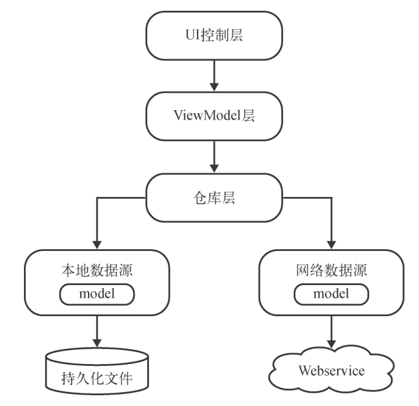

# 仿彩云天气

为了满足上传文件大小满足不超过15M的要求因此删除了工程文件中的大部分中间编译结果。

如果老师有因为我误删而无法编译启动程序的话，可以我的github地址获取未删减的项目文件。

[仿彩云天气]()

## 产品介绍
一个简单的天气查询APP，借由[彩云天气](https://dashboard.caiyunapp.com/)的api可以实现以下功能：

- *可以搜索全球大多数国家的各个城市数据*
- *可以查看全球绝大多数城市的天气信息*
- *可以自由地切换城市，查看其他城市的天气*
- *可以手动刷新实时的天气*

项目整体使用MVVM架构构建：

## 大致的代码执行流程
### 启动
启动类使用默认的MainActivity，该Activity会加载渲染一个用于提供城市查询的Fragment组件，与用户交互后可以跳转到天气数据的跳转Activity中。

项目里只有这个Fragment应用了相关的持久化技术。因为考虑到用户每次打开软件都需要重新查询显得十分不合理，使用SharedPreferences来保存用户最后一次的查询记录。

### 城市查询
查询界面的Fragment只使用了一个EditText来实现交互。在addTextChangedListener的监听事件中由仓库层的接口向网络层发起请求获得JSON数据，并通过Gson提供的注解自动将其转换为实体类向上层返回。

### 数据展示的页面
使用一个自定义Sky类来负责封装来自F的数据信息并进行展示。相关逻辑在代码中。
